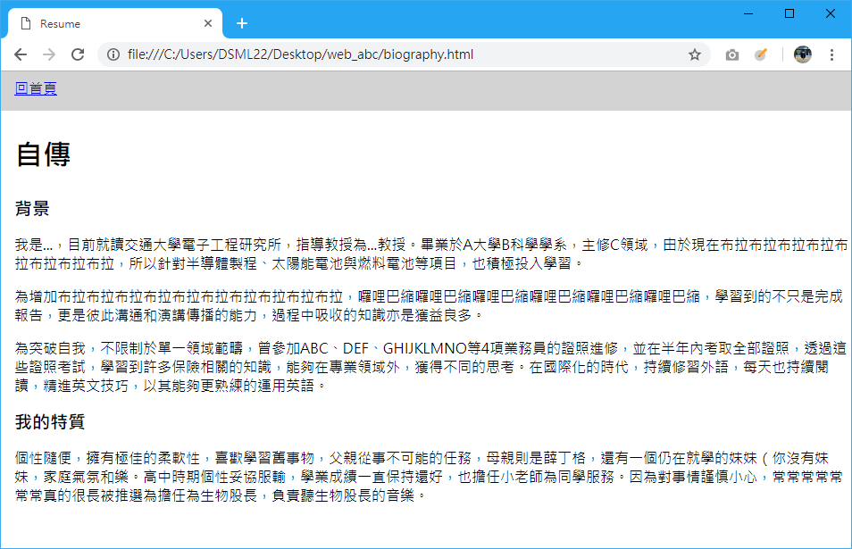

# About A Webpage

## Webpage = HTML + CSS + ...

不管是看似簡單如Google、或者是看似複雜如Facebook，他們都是由最基本的HTML和CSS所組成。

HTML是一種表達的格式，就像你知道什麼是`.doc`或者`.docx`，而你也知道我的Word檔案裡面可以設定字型、顏色、段落行距等等，而這些就要由CSS來達成。

### 入門

首先，我們要知道我們可以做到什麼，所以直接來範例，請在桌面新增一個資料夾叫做`web_abc`，好啦檔名真的隨意，之後我們要用的檔案都要放裡面就對了。

在資料夾`web_abc`裡面新增一個檔案叫做`biography.html`，打開任意文字編輯器（WordPad、記事本、或感覺厲害一點UltraEdit、Sublime Text都可以 ），無腦貼上以下內容。



```markup
<html>
<head>
	<meta charset="UTF-8">
	<title>Biography</title>
	<style>
		html, body {
			font-family: -apple-system,"微軟正黑體","Helvetica Neue",Arial,sans-serif;
			padding: 0;
			margin: 0;
		}
		p {
			margin-top: 0;
		}
		h1 {
			font-size: 2em;
		}
		h2 {
			font-size: 1.25em;
		}
		.bg-light {
			background-color: lightgray;
		}
		.y-box {
			padding-top: .5em;
			padding-bottom: .5em;
		}
		.x-box {
			padding-left: 15px;
			padding-bottom: 15px;
		}
	</style>
</head>
<body>
	<header>
		<nav id="navbar">
			<p class="bg-light x-box y-box"><a href="resume.html">回首頁</a></p>
		</nav>
	</header>
	<section class="x-box">
		<h1>自傳	</h1>
		<article>
			<h2>背景</h2>
			<p>我是...，目前就讀交通大學電子工程研究所，指導教授為...教授。畢業於A大學B科學學系，主修C領域，由於現在布拉布拉布拉布拉布拉布拉布拉布拉，所以針對半導體製程、太陽能電池與燃料電池等項目，也積極投入學習。 </p>
			<p>為增加布拉布拉布拉布拉布拉布拉布拉布拉布拉布拉，囉哩巴縮囉哩巴縮囉哩巴縮囉哩巴縮囉哩巴縮囉哩巴縮，學習到的不只是完成報告，更是彼此溝通和演講傳播的能力，過程中吸收的知識亦是獲益良多。 </p>
			<p>為突破自我，不限制於單一領域範疇，曾參加ABC、DEF、GHIJKLMNO等4項業務員的證照進修，並在半年內考取全部證照，透過這些證照考試，學習到許多保險相關的知識，能夠在專業領域外，獲得不同的思考。在國際化的時代，持續修習外語，每天也持續閱讀，精進英文技巧，以其能夠更熟練的運用英語。 </p>
		</article>
		<article>
			<h2>我的特質</h2>
			<p>個性隨便，擁有極佳的柔軟性，喜歡學習舊事物，父親從事不可能的任務，母親則是薛丁格，還有一個仍在就學的妹妹（你沒有妹妹，家庭氣氛和樂。高中時期個性妥協服輸，學業成績一直保持還好，也擔任小老師為同學服務。因為對事情謹慎小心，常常常常常常常真的很長被推選為擔任為生物股長，負責聽生物股長的音樂。 </p>
		</article>
	</section>
</body>
</html>
```



在資料夾內找到檔案並開啟他，會開啟瀏覽器例如Chrome，顯示這樣。



恭喜你，你的第一個網頁做好了，很簡單吧！

> ：Eray你怎麼看？  
> ：（迷之音，Eray是誰？）

### 動手時間

現在，試著修改文字內容看看看看網站會有什麼變化。


修改檔案後，記得在瀏覽器重新整理。



