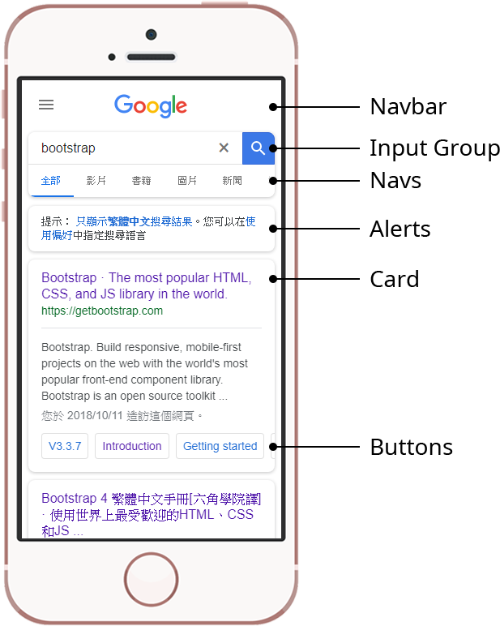

# Yes, Bootstrap

一樣範例直接來。

首先我們前往[官網](https://getbootstrap.com/docs/4.1/getting-started/introduction/)引入他們的CSS樣式，這樣才可以在我們的網頁上使用，或者複製底下這個`link`到網頁的`<head>`標籤裡。

```markup
<link rel="stylesheet" href="https://stackpath.bootstrapcdn.com/bootstrap/4.1.3/css/bootstrap.min.css" integrity="sha384-MCw98/SFnGE8fJT3GXwEOngsV7Zt27NXFoaoApmYm81iuXoPkFOJwJ8ERdknLPMO" crossorigin="anonymous">
```

這裡使用`link`來外連一個CSS檔案，引入了CSS之後，你應該會發現網頁的樣式出現了一些改變。現在，你就可以開始使用Bootstrap寫好的樣式，例如我們做一個卡（Card）、裡面放一些按鈕（Button）。



```markup
<html>
<head>
	<meta charset="UTF-8">
	<title>Document</title>
	<link rel="stylesheet" href="https://stackpath.bootstrapcdn.com/bootstrap/4.1.3/css/bootstrap.min.css" integrity="sha384-MCw98/SFnGE8fJT3GXwEOngsV7Zt27NXFoaoApmYm81iuXoPkFOJwJ8ERdknLPMO" crossorigin="anonymous">
	<style>
		/* No more style needed for general bootstrap use.
		 * But you still need writing CSS for customization.
		 */
		.card {
			margin: 15px;
			max-width: 400px;
			box-shadow: 0 .5em 1em rgba(0,0,0,.15);
		}
		.card-subtitle {
			margin-bottom: .5em;
		}
	</style>
</head>
<body>
	<div class="card">
		<div class="card-body">
			<h4 class="card-title">Card</h5>
			<h5 class="card-subtitle">A card component of bootstrap.</h6>
			<p class="card-text">Some quick example text to build on the card title and make up the bulk of the card's content.</p>
			<a href="#" class="btn btn-primary">Got it</a>
			<a href="#" class="btn btn-link text-danger">Dismiss</a>
		</div>
	</div>
</body>
</html>
```



Bootstrap的官方文件由於寫的過於完善，導致新手可能會有閱讀障礙，所以這邊簡單做個導讀，把重要的部分先解釋一下。

### Component

元件組（Component）是Bootstrap提供的一大實用功能，透過複製範例中的HTML原始碼，我們就可以快速的做出很多不錯看的元件，例如一個手機板的Google首頁可以使用如圖所示元件組來做到。



當然，Google並不是使用Bootstrap，但是如果你懶得自己手刻的話，Bootstrap確實提供我們非常快速的解決方案，能夠使用的元件組請參閱[官方文件Components頁面](https://getbootstrap.com/docs/4.1/components/alerts/)寫在左側的導覽列中Components項目裡。每個範例都有原始碼可以複製貼上。基本的元件組做好之後，要個人化就可以額外再自己動手寫CSS樣式囉，是不是比重零開始設計來的有效率呢！


互動式元件組必須額外引入Javascript程式庫方可正常運作。


#### For Those Interactive

那些按按滑鼠會改變的元件組、或者元件組會自己動來動去的，會需要額外引入幾個Javascript檔案才能讓他們正常動作，有需要的同學，可以看[官網Introductionk](https://getbootstrap.com/docs/4.1/getting-started/introduction/#js)的JS段落，或者複製底下這個`script`到網頁的`</body>`標籤前面。

```markup
<script src="https://code.jquery.com/jquery-3.3.1.slim.min.js" integrity="sha384-q8i/X+965DzO0rT7abK41JStQIAqVgRVzpbzo5smXKp4YfRvH+8abtTE1Pi6jizo" crossorigin="anonymous"></script>
<script src="https://stackpath.bootstrapcdn.com/bootstrap/4.1.3/js/bootstrap.min.js" integrity="sha384-ChfqqxuZUCnJSK3+MXmPNIyE6ZbWh2IMqE241rYiqJxyMiZ6OW/JmZQ5stwEULTy" crossorigin="anonymous"></script>
<script src="https://cdnjs.cloudflare.com/ajax/libs/popper.js/1.14.3/umd/popper.min.js" integrity="sha384-ZMP7rVo3mIykV+2+9J3UJ46jBk0WLaUAdn689aCwoqbBJiSnjAK/l8WvCWPIPm49" crossorigin="anonymous"></script>
```

官網明確的寫到有需要的元件組，分別會使用的Javascript檔案，如果沒用到也可以不用引入，底下列出表格以顯示會用到的Javascript檔案。

| Functions | jQuery+Bootstrap | Popper |
| :--- | :---: | :---: |
| **Alerts** for dismissing | ⬤ | - |
| **Buttons** for toggling states and checkbox/radio functionality |  ⬤  | - |
| **Carousel** for all slide behaviors, controls, and indicators | ⬤ | - |
| **Collapse** for toggling visibility of content | ⬤ | - |
| **Dropdowns** for displaying and positioning | ⬤ | ⬤ |
| **Modals** for displaying, positioning, and scroll behavior | ⬤ | - |
| **Navbar** for extending our Collapse plugin to implement responsive behavior | ⬤ |  - |
| **Tooltips** and **popovers** for displaying and positioning | ⬤ |  ⬤ |
| **Scrollspy** for scroll behavior and navigation updates | ⬤ | - |

其中一定會用到的就是jQuery和Bootstrap，Popper則是有用到的才需要。

在完成我們的元件組之後，我們需要把這些元件組放到網頁的各個地方，以做出想要的佈局，而Bootstrap也提供了許多好用的佈局設計樣式，還能夠輕鬆做出響應式網頁設計（ Responsive Web Design）。

### Layout - Grid System

Bootstrap使用了網格（Grid）的概念，把網頁佈局（Layout）分成12個欄位，而我們在前面的章節學到了格子的概念，網格就提供這些格子一些對齊的位置。


對格子還不熟的同學，可以回到[前面章節](what-is-html.md#layout-of-a-webpage)複習。


譬如在我們練習過的`layout.html`中使用網格。


要做到這件事情，我們必須把盒子放在一個由`.container`及`.row`所組成的結構裡面，而盒子的`class`屬性要設定為`.col-#`，其中`#`代表著格子需要的欄數。

譬如上圖中的第一列，就可以用下面的HTML來完成。

```markup
<div class="container">
	<div class="row">
		<div class="col-3">
			layout.html
		</div>
		<div class="col-9">
			<h2>Title</h2>
			<p>...</p>
		</div>
	</div>
	<!-- More .row can be included. -->
</div>
```

#### Responsive to Screen Size

前面提到了響應式，其最基本的原理就是看瀏覽器的視窗寬度，Bootstrap提供的幾個預設的中斷點（Break-point），可以方便的對應到手機、平板、以及電腦。

| Screen Window Size ▶ | Extra small &lt;576px | Small ≥576px | Medium ≥768px | Large ≥992px | Extra large ≥1200px |
| :--- | :---: | :---: | :---: | :---: | :---: |
| **Class prefix** | `.col-` | `.col-sm-` | `.col-md-` | `.col-lg-` | `.col-xl-` |
| Phone | ▮ |  ▬ |  ▬ | - | - |
| Tablet | - |  ▮ | ▮ | ▬ | ▬ |
| Desktop | - |  - | ▬ | ▬ | ▬ |

各個視窗寬度大致可以對應到如表格顯示的裝置，直向以▮表示、橫向以 ▬表示。

設定方法為從最小的寫到最大的，所以如果我們想要設定一個格子在手機上滿版、平板上佔一半、電腦上看佔1/3，就可寫成如下HTML。

```markup
<div class="col-12 col-sm-6 col-md-4">A div having width at 100% on phone, 50% on tablet, and 33.3% on desktop.</div>
```

### 動手時間

我們學到使用一個框架的便利性、及彈性，那麼我便可以試著把之前做過的網頁例如`resume.html`、`biography.html`和`layout.html`，全部都改用Bootstrap做看看吧，看看引用了框架後，自己可以少寫多少行原始碼！（這真的是動力）


請盡可能讀遍[Bootstrap Document](https://getbootstrap.com/docs/4.1/getting-started/introduction/)或由六角學院翻譯的[中文版Bootstrap文件](https://bootstrap.hexschool.com/docs/4.0/getting-started/introduction/)。



