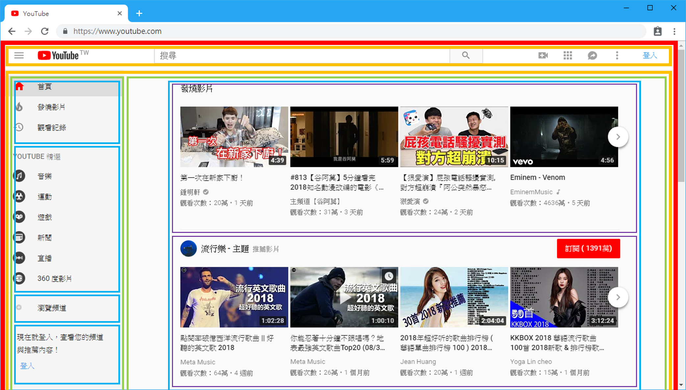
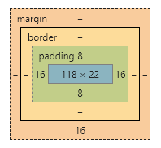
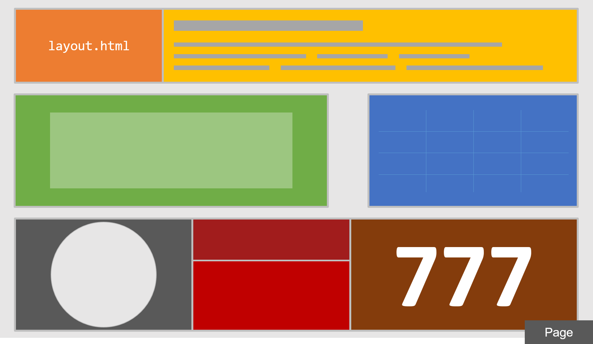

# What is HTML?

## A HTML File

大家都很聰明，所以[範例](../#ru)看完應該就會了，那我們今天到這邊結束（揍飛

### Structure

一個最簡單的HTML文件結構長這樣：



```markup
<html>
<head>
	<meta charset="UTF-8">
	<title>Document</title>
	<style>
	
	</style>
</head>
<body>
	
</body>
</html>
```



你也可以從前面提到的範例`biography.html`檔案中看出一些端倪。先不要管這些東西是什麼、或者為什麼要寫成這樣，我們只要知道，之後我所提示的所有HTML內容，都要寫在`<body></body>`這兩個標籤之間就可以了。

例如我們開始在body內寫一些網頁內容：

```markup
<header>
	<nav id="navbar">
		<p class="bg-light x-box y-box"><a href="index.html">回首頁</a></p>
	</nav>
</header>
<section class="x-box">
	<h1>自傳</h1>
	<article>
		<h2>背景</h2>
		<p>...</p>
	</article>
	<!-- /article -->
	<!-- This is not in example index.html but it doesn't matter
	     Too long, so let me stop repeating article here -->
</section>
```


`<!--  -->`用來附註，可以多行。


### Tags and Attributes

HTML這樣的格式會用各種「標籤（Tag）」標示出內容，例如範例中的`<header>`、`<nav>`、`<section>`、`<article>`、`<p>`等等，兩兩一組：起始標籤`<p>`與結束標籤`</p>`。[W3Schools](https://www.w3schools.com/tags/ref_byfunc.asp)這裡列出所有可用的標籤，語意化讓你可以一眼看出這是導覽列`<nav>`、章節`<section>`、文章`<article>`、或者標題一`<h1>`、標題二`<h2>`、段落`<p>`。

而那些寫在起始標籤裡面的東西，就是屬於該標籤自己的「屬性（Attribute）」，像是我給`<nav>`設定一個`id`、給一個段落`<p>`設定分類`class`、或者給一個超連結`<a>`設定網址`href`。這些東西都是可以讓各種HTML標籤記錄一些不需要顯示卻極為重要的特性或資訊。

關於HTML這個格式怎麼表達，也可以參考這些網站：​

* [MDN Web docs](https://developer.mozilla.org/zh-TW/docs/Learn/Getting_started_with_the_web/HTML_basics)
* [W3Schools](https://www.w3schools.com/)
* [Codecademy](https://www.codecademy.com/catalog/language/html-css)

或者，就Google。

### A Basic of CSS

人要金裝，佛要衣裝（不對，網頁要CSS裝。CSS樣式表在網頁裡會在`<style></style>`這兩個標籤之間，寫入一些修飾性的文字，例如：

```css
html, body {
	font-family: -apple-system,"微軟正黑體","Helvetica Neue",Arial,sans-serif;
	padding: 0;
	margin: 0;
}
p {
	margin-top: 0;
}
h1 {
	font-size: 2em;
}
/* ... */
.bg-light {
	background-color: lightgray;
}
/* 
... Again, this is a comment.
*/
```


`/* */`用來附註，可以多行。


CSS用這樣的格式來為剛剛的HTML內容做樣式的改變，要怎麼寫呢？

我們需要選擇一個HTML有寫到的元素來進行修改，所以第一個要寫「選擇器（Selector）」，而後面接著的大括號內則書寫我們想要修改的樣式。

例如我們想要修改標題一`<h1>`的字體大小`font-size`為`2em`，就寫為

```css
h1 {
	font-size: 2em;
}
```

有關選擇器的寫法，[W3Cschool](https://www.w3schools.com/cssref/css_selectors.asp)這裡列出了全部你可以用的選法，並且你可以點進各個項目看範例，這裡就不贅述。

> ：em是什麼？  
> ：[傳送門](https://www.google.com.tw/search?q=css+em)

一個重要的觀念是：在一份HTML檔案中，一個`id`只會出現一次；而同一個`class`可以被重複用很多次。

### 動手時間

我們學到了更多關於HTML的知識，所以現在可以使用更多的Tag來放置更複雜的元素，以及使用CSS樣式表來美化我們的網頁。

在我們的第一個範例`biography.html`中，你會發現左上角的連結顯示「找不到您的檔案」的錯誤。現在就讓我們來練習新學到的知識，來做一份簡歷吧！

請在資料夾`web_abc`內新增一個網頁檔案`resume.html`，並至少完成以下要求：

* [ ] img照片
* [ ] a連結\(例如Facebook\)
* [ ] table表格
* [ ] 要有導覽列可以來回`resume.html`和`biography.html`
* [ ] 簡單設計樣式


你隨時可以按下「右鍵、檢查」來使用[檢閱器](https://developers.google.com/web/tools/chrome-devtools/)查看一個網頁的所有內容。


#### 範本



## Layout of A Webpage

為了要進一步做到網頁排版的效果，我們要會使用空間類型的標籤，例如div、section、aside等，並且了解他們彼此之間如何做到區隔以及排列。

### Concept of Box

網頁可以看成是由許許多多大大小小的盒子（Box）所組成，這個盒子則基本上以CSS樣式設定`display: block;`的元素為主，是整個網頁排版的核心。例如最常見的div這個HTML標籤就是預設為`block`，其他像是header、footer、section、aside等也都是預設顯示為`block`。

我們來看看Youtube首頁的格子分布，



概念就是，層層包圍。大盒子包住中盒子、中盒子包住小盒子、小盒子包住微盒子、微盒子包住奈米盒子…（沒有形容詞了），就是俄羅斯娃娃的概念。

你可以在盒子裡面放入很多盒子，而我們會利用這些盒子的排列，透過CSS的修飾來為網頁進行排版。

### Padding & Margin

每個盒子的內容，都可以再放入盒子、或者是一般的段落文字，而一個盒子的寬（Width）與高（Height）的定義，就是所包含內容的大小。而這個內容大小到盒子的界線（Border）之間的距離，就稱為內距（Padding）。

而盒子與盒子界線的距離，則稱為外距（Margin）。

這些關於「界」的設定，都可以分別指定其距離，所以你可能就會看到這個圖。



最中間藍色顯示的就是內容的寬 x 高、綠色的是Padding、黃色的是Border、而最外圍橘色的就是Margin，圖中跟「界」有關的樣式表，可以寫成

```css
div {
    padding: 8px 16px;
    margin: 0 0 16px;
}
```

如果你想看到某個盒子的界線到底在哪裡，可以多設定一個Border。

```css
border: 1px solid red;
```

或者使用不會影響排版的輪廓（Outline）來設定，也可以清楚的看到界線。

```css
outline: 1px solid blue;
```

什麼，Border會影響排版？你可以各別給個`30px`就看的出差別了（笑。

### 動手時間

試著利用剛學到的空間、以及盒子的概念來做一個網頁吧！試著做出一個網頁類似以下圖示。



請在資料夾`web_abc`內新增一個網頁檔案`layout.html`，並至少完成以下要求：

* [ ] 每個盒子要有自己的背景
* [ ] 盒子之間要有間隔
* [ ] 盒子內要放不同HTML標籤
* [ ] 右下角的Page要能固定在視窗，不隨著滾輪移動


[學習CSS版面配置](http://zh-tw.learnlayout.com/toc.html)清楚的介紹了排版上許多好用的CSS樣式，遇到困難時不妨去看看吧！


#### 範本

做完可能會類似這樣。



## A Break Time

我們現在應該已經可以自己做出幾個HTML網頁，並且利用各種CSS樣式來修改網頁的長相。頁面之間可以互相瀏覽，並且可以簡單利用一些盒子的概念，來規劃我的頁面。

辛苦你了！

純手刻HTML及CSS就到這裡為止，買杯純喫茶好好休息一下，接下來我們就可以開始學習使用別人做好的框架（Framework），無腦複製貼上，來快速做出許多實用且有趣的組合物件，而不用自己慢慢的寫原始碼。


