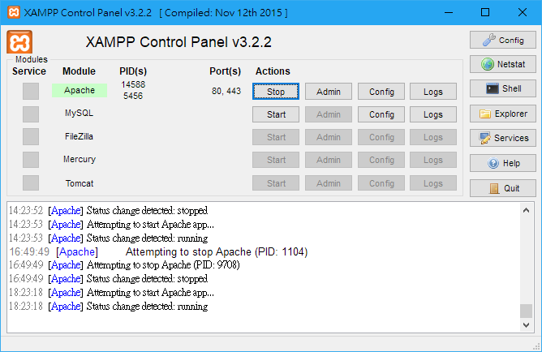

# Your First PHP Page

PHP需要在合適的環境下才能執行使用，而最簡單的方法就是給他一個伺服器的環境。

## Environment

[XAMPP](https://www.apachefriends.org/zh_tw/index.html)提供了一個簡單的解決方案，讓你輕鬆在電腦上直接裝好Apache伺服器以及MySQL資料庫，一次搞定免去大量設定，裝好後我們就可以開啟伺服器來執行我們的PHP網站。

裝好後開啟XAMPP Control Panel，會出現在Windows右下角的小工具圖示，我們把Apache開啟按下Start。



開啟後如圖所示，我們還不需要用到MySQL資料庫，所以只要先開啟Apache伺服器就可以了。網站的預設根目錄會在`C:\xampp\htdocs`，如果你安裝XAMPP在其他地方，找到`htdoc`這個資料夾就是我們伺服器的預設根目錄。

打開瀏覽器，網址輸入`localhost`，XAMPP預設會跳轉至歡迎頁面`localhost/dashboard/`。

如果現在有看到「Welcome to XAMPP」的頁面，就代表伺服器架設成功，接下來就讓我們放入自己的PHP網頁吧。

## A PHP File

一個最簡單的PHP文件結構長這樣：



```php
<?php ?>
```



欸，沒東西。是的，`<?php ?>`只是我們用來告訴伺服器說要執行PHP程式碼的地方，現在讓我們加入一點程式碼。



```php
<?php
    echo "Your first PHP webpage!!";
?>
```



把這個內容存檔為`index.php`取代掉原本放在`C:\xampp\htdocs`資料夾裡預設的`index.php`，瀏覽器網址輸入`localhost`，現在你會看到頁面顯示。

```text
Your first PHP webpage!!
```

更多關於PHP的語法，可以參考[TwHappy部落格網誌](http://www.twhappy.com/index.php?action=show&no=96)，我們這邊要來談談PHP與HTML愛恨情仇的合作關係。

## HTML In PHP

第一點，PHP檔案裡面可以直接寫入HTML原始碼，你只要把HTML原始碼寫在`<?php ?>`的範圍之外效用等同於一般HTML網頁，甚至一個PHP檔案裡可以不包含任何PHP程式，只拿來寫HTML也可以，例如。



```php
<html>
<head>
	<meta charset="UTF-8">
	<title>Document</title>
	<style>
	
	</style>
</head>
<body>
	<h1>It Works!</h1>
</body>
</html>
```



請留意，現在的副檔名是`.php`，所以必須在伺服器環境下才能執行看到，但文件內容看起來就就只是一般的HTML網頁。那我們現在來把PHP程式碼放進去，可以放在任何位置，只要記得要用`<?php ?>`把程式碼包起來。



```php
<html>
<head>
	<meta charset="UTF-8">
	<title>Document</title>
	<style>
	
	</style>
</head>
<body>
	<h1>It Works!</h1>
	<?php
	    echo "<p>Your first PHP webpage!!</p>";
	?>
</body>
</html>
```



```markup
<html>
<head>
	<meta charset="UTF-8">
	<title>Document</title>
	<style>
	
	</style>
</head>
<body>
	<h1>It Works!</h1>
	<p>Your first PHP webpage!!</p>
</body>
</html>
```



把這個內容存檔為`index.php`取代掉原本放在`C:\xampp\htdocs`資料夾裡的`index.php`，瀏覽器網址輸入`localhost`並重新整理，現在你就可以看到一個由PHP產生的網頁，按下「滑鼠右鍵、檢視網頁原始碼」，你就可以看到PHP執行後所動態產生的HTML網頁檔案。

這有甚麼用呢？用途可多了。

### Include PHP Files



伺服器使用完畢之後，請務必回到XAMPP Control Panel將Apache按下Stop關閉。



